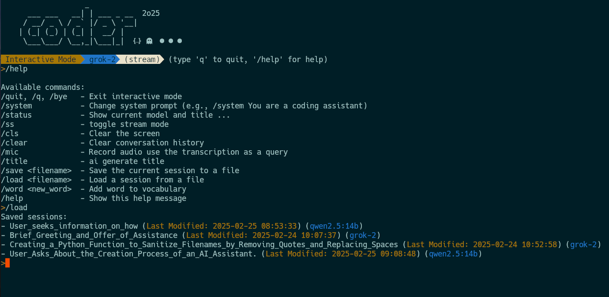

# ai_llm - Your Command-Line AI Assistant

`ai_llm` is a powerful command-line interface (CLI) tool designed to interact with various AI models directly from your terminal. It supports popular models like Gemini, OpenAI, Ollama, Anthropic, and more, enabling you to ask questions, manage conversations, and leverage AI in your daily workflow.

## Features

* **Multi-Model Support:** Access a wide range of AI models including Gemini, OpenAI, Ollama, Anthropic, Xai, DeepSeek, Grok, and Llama.
* **Interactive Chat Mode:** Engage in continuous conversations with AI models in an interactive terminal session.
* **Streaming Responses:** Experience real-time, streamed responses for a more fluid interaction (optional).
* **Single Query Mode:** Ask quick questions and get concise answers directly from the command line.
* **Configuration:** Set a default model for convenience and customize your experience.
* **Command History Clearing:** Easily clear conversation history within interactive mode.
* **System Prompt Customization:** Adjust the AI's behavior with custom system prompts.
* **Audio Input (via `/mic`):** Use voice input by recording audio with `/mic` and transcribing it as your query.
* **Session Saving & Loading:** Save and load interactive chat sessions to preserve important conversations.
* **Command Completion:** Enjoy command completion in interactive mode for faster and more accurate command entry.
* **Syntax Highlighted Output:** Responses are displayed with Markdown syntax highlighting for better readability.
* **Busy Indicator:** Visual feedback during processing with `/tmp/act` and `/tmp/ai_ack` signaling.
* **File Monitoring:** Monitor `/tmp/mic.md` for updates and send content to the chat session concurrently.

## Installation

### Prerequisites

* **Rust Toolchain:** Ensure you have Rust and Cargo installed. You can get them from [rustup.rs](https://rustup.rs/).
* **Dependencies:** This tool leverages the `genai`, `serde_json`, `chrono`, and `tokio` crates for AI model interaction, JSON handling, date formatting, and concurrency. These will be automatically handled by Cargo.
* **(Optional) Audio Input:** If you want to use voice input, ensure `/tmp/mic.md` is writable.

### Building from Source

1. **Clone the repository:**
   ```bash
   git clone <repository_url>  # Replace <repository_url> with the actual repository URL
   cd ai_llm
   ```

2. **Build the project using Cargo:**
   ```bash
   cargo build --release
   ```

3. **Add the executable to your PATH (optional):**
   For easier access, you can add the compiled executable to your system's PATH. The executable will be located at `target/release/ai_llm`.

   * **Linux/macOS:**
     ```bash
     export PATH="$PATH:$HOME/.cargo/bin:$PWD/target/release" # Add to your .bashrc or .zshrc for persistence
     ```
   * **Windows:**
     Add `target\release` directory to your system's environment variables.

## Usage

### Basic Command
```bash
ai_llm --help
```
This will display the help message, showing available options and subcommands.

### Setting the Model
You can specify the model to use with the `--model` option:
```bash
ai_llm --model gemini-pro query -q "What is the capital of France?"
```
If you don't specify a model, it will use the default model: `gemini-2.0-flash`. You can change the default model using the `set-default` subcommand.

### Streaming Responses
To enable streaming responses, use the `--stream` flag:
```bash
ai_llm --stream --model gemini-pro query -q "Explain quantum physics."
```

### Single Query Mode
To ask a single question and exit, use the `query` subcommand:
```bash
ai_llm query --question "What are the benefits of using Rust?" --model gemini-pro
```
or shorthand:
```bash
ai_llm query -q "What are the benefits of using Rust?" -m gemini-pro
```

### Interactive Mode
To enter interactive chat mode, run `ai_llm` without any subcommands or with the `interactive` subcommand:
```bash
ai_llm
ai_llm interactive
```

In interactive mode, you can type your questions and commands directly.

#### **Interactive Mode Commands:**
* `/help` or `?`: Show help message and list available interactive commands.
* `/quit`, `/q`, `/bye`: Exit interactive mode.
* `/cls`: Clear the terminal screen.
* `/clear`: Clear the conversation history (starts a fresh conversation).
* `/system <new system prompt>`: Set a new system prompt to guide the AI's behavior (e.g., `/system You are a helpful coding assistant`).
* `/mic`: Start audio recording and use the transcription as your query.
* `/save <filename>`: Save the current chat session to a file (JSON format).
* `/load <filename>`: Load a previously saved chat session from a file.
* `/title`: Summarize the dialog as a title.
* `/status`: Display current session settings (model, system prompt, and title).
* `/model <model_name>`: Set the model for the current session.
* `/ls`: Alias for `list-models` to display all available models.

**Example Interactive Session:**
```
Interactive Mode (type 'q' to quit, '/help' for help)
Using Model: gemini-2.0-flash
User: Hello
Assistant: Hello! How can I help you today?
User: /system You are a funny assistant
Updated system prompt: You are a funny assistant
User: Tell me a joke
Assistant: Why don't scientists trust atoms? Because they make up everything! 😂
User: /save my_session.json
Session saved to 'my_session.json'
User: /clear
Conversation history cleared.
User: /load my_session.json
Session loaded from 'my_session.json'
User: Hello again
Assistant: Well, hello again! Ready for more laughs or something else? 😉
User: q
```


### Listing Available Models
To see a list of available models for different providers, use the `list-models` subcommand:
```bash
ai_llm list-models
```
or its alias:
```bash
ai_llm ls
```

### Setting the Default Model
To set a new default model, use the `set-default` subcommand:
```bash
ai_llm set-default --model gemini-pro
ai_llm set-default gemini-pro  # shorthand
```

## Configuration

The `ai_llm` tool stores its configuration in a `config.toml` file located in your system's config directory (e.g., `~/.config/ai_llm` on Linux/macOS).

Currently, the only configurable setting is the `default_model`. You can modify this setting directly in the `config.toml` file or using the `set-default` subcommand.

**Example `config.toml`:**
```toml
default_model = "gemini-pro"
```

## Contributing

Contributions are welcome! If you have ideas for improvements, bug fixes, or new features, please feel free to open an issue or submit a pull request on the [GitHub repository](<repository_url>).

## License

This project is licensed under the [MIT License](LICENSE) - see the [LICENSE](LICENSE) file for details.

